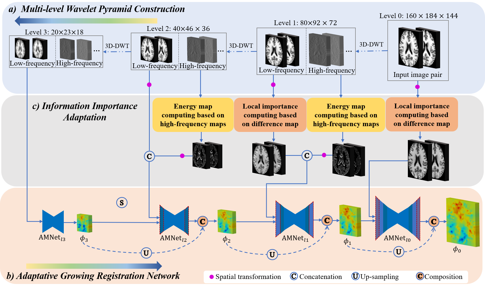
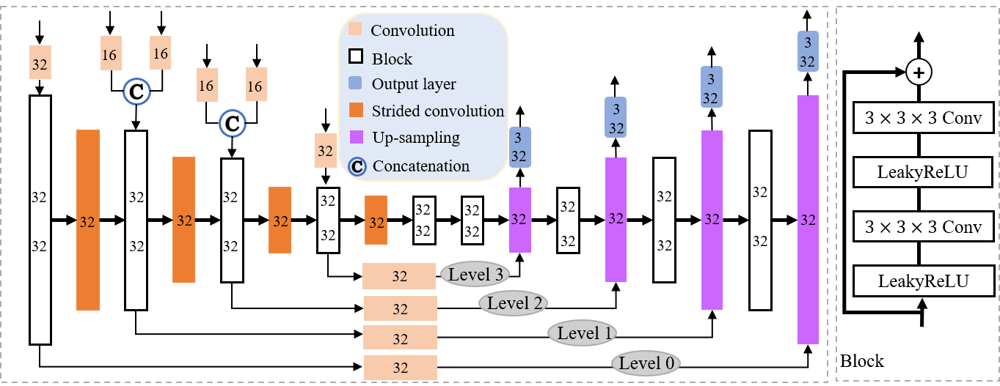

## **AMNet: Adaptive multi-level network for deformable registration of 3D brain MR images**

Three-dimensional (3D) deformable image registration is a fundamental technique in medical image analysis tasks. Although it has been extensively investigated, current deep-learning-based registration models may face the challenges posed by deformations with various degrees of complexity. This paper proposes an adaptive multi-level registration network (AMNet) to retain the continuity of the deformation field and to achieve highperformance registration for 3D brain MR images. First, we design a lightweight registration network with an adaptive growth strategy to learn deformation field from multi-level wavelet sub-bands, which facilitates both global and local optimization and achieves registration with high performance. Second, our AMNet is designed for image-wise registration, which adapts the local importance of a region in accordance with the complexity degrees of its deformation, and thereafter improves the registration efficiency and maintains the continuity of the deformation field. Experimental results from five publicly-available brain MR datasets and a synthetic brain MR dataset show that our method achieves superior performance against state-of-the-art medical image registration approaches.

### **Prerequisites**
Python 3.5.2+; 
Pytorch 1.3.0 - 1.7.0; 
NumPy; 
NiBabel

This code has been tested with Pytorch 1.6.0 and GTX1080TI GPU.

### **Main Pipeline**

### **Train your own model**
You may adjust the size of the model and the size of image. 
python Train.py to train your own model. 

### Publication

If you find this repository useful, please cite:
AMNet: Adaptive multi-level network for deformable registration of 3D brain MR images
@article{che2023amnet,
  title={AMNet: Adaptive multi-level network for deformable registration of 3D brain MR images},
  author={Che, Tongtong and Wang, Xiuying and Zhao, Kun and Zhao, Yan and Zeng, Debin and Li, Qiongling and Zheng, Yuanjie and Yang, Ning and Wang, Jian and Li, Shuyu},
  journal={Medical Image Analysis},
  volume={85},
  pages={102740},
  year={2023},
  publisher={Elsevier}
}
